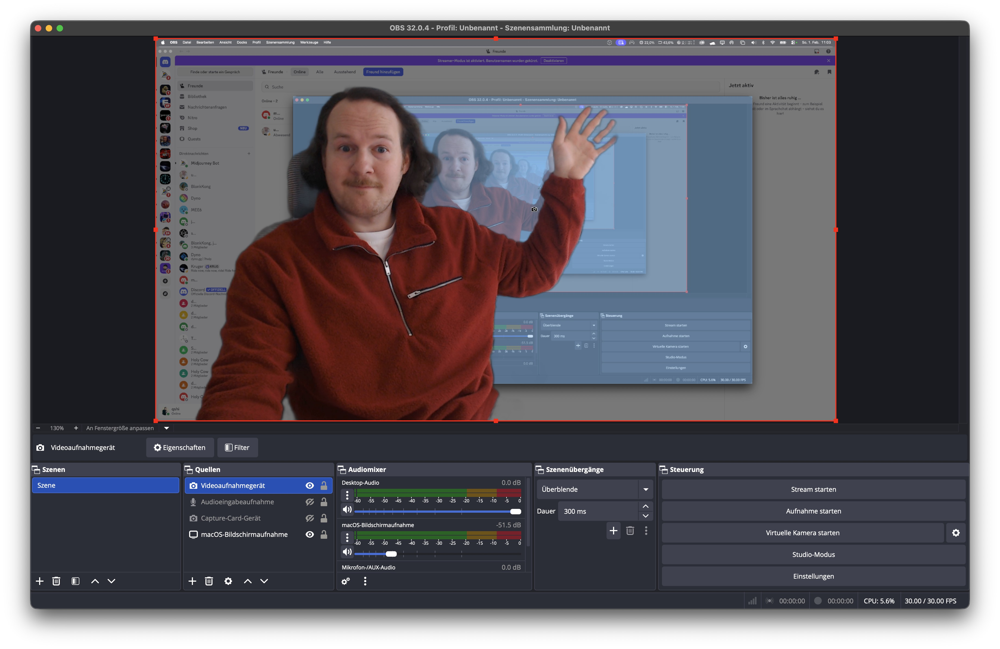

# Vision Background Removal for OBS

A high-performance background removal plugin for OBS Studio on macOS, powered by Apple's Vision Framework.




## Features

- **Real-time background removal** using Apple Vision Framework
- **Hardware accelerated** on Apple Silicon (M1/M2/M3/M4)
- **Multiple background modes:**
  - Blur background
  - Solid color (green screen replacement)
  - Transparent (for compositing)
- **Adjustable quality** (Fast/Balanced/Accurate)
- **Edge smoothing** for natural-looking results
- **Low latency** - optimized for live streaming

## Requirements

- macOS 13.0 (Ventura) or later
- Apple Silicon Mac (M1, M2, M3, M4)
- OBS Studio 29.0 or later

> **Note:** This plugin does NOT work on Intel Macs. It requires Apple Silicon for the Vision Framework's Neural Engine acceleration.

## Installation

### Download

1. Download the latest release from the [Releases](../../releases) page
2. Unzip the downloaded file
3. Copy `vision-background-removal.plugin` to:
   ```
   ~/Library/Application Support/obs-studio/plugins/
   ```
4. Restart OBS Studio

### Using Terminal

```bash
# Create plugins directory if needed
mkdir -p ~/Library/Application\ Support/obs-studio/plugins

# Copy plugin (adjust path to your download location)
cp -r ~/Downloads/vision-background-removal.plugin ~/Library/Application\ Support/obs-studio/plugins/
```

## Usage

1. Add a video source (e.g., Video Capture Device)
2. Right-click the source → **Filters**
3. Click **+** under Effect Filters
4. Select **"Vision Background Removal"**
5. Configure settings:
   - **Quality:** Fast (60fps) / Balanced (30fps) / Accurate (15fps)
   - **Background:** Blur / Solid Color / Transparent
   - **Blur Radius:** Intensity of background blur
   - **Edge Smoothing:** Smoothness of person outline

## Settings

| Setting | Description |
|---------|-------------|
| Enable | Toggle the filter on/off |
| Quality | Balance between performance and accuracy |
| Background | Blur, Solid Color, or Transparent |
| Blur Radius | Strength of background blur (5-50) |
| Background Color | Color for solid background mode |
| Edge Smoothing | Smoothness of mask edges (0-5) |

## Building from Source

### Prerequisites

- Xcode Command Line Tools
- CMake 3.28+

### Build

```bash
# Install CMake if needed
brew install cmake

# Clone the repository
git clone https://github.com/qshiqshi/vision-background-removal.git
cd vision-background-removal

# Build
mkdir build && cd build
cmake .. -DCMAKE_BUILD_TYPE=Release
cmake --build . --config Release

# The plugin will be at:
# build/vision-background-removal.plugin/
```

## Performance Tips

- Use **Balanced** quality for most streaming scenarios
- Lower your webcam resolution to 720p if experiencing performance issues
- Ensure good lighting for better segmentation results
- Keep some distance from your background

## Troubleshooting

### Plugin doesn't appear in OBS

- Ensure the plugin is in the correct folder
- Check that you're using the native ARM version of OBS (not Rosetta)
- Restart OBS completely (Cmd+Q, then reopen)

### OBS crashes when enabling filter

- Make sure you're on macOS 13.0 or later
- Verify you have an Apple Silicon Mac
- Check OBS logs: `~/Library/Application Support/obs-studio/logs/`

### Poor segmentation quality

- Improve lighting (front-facing light works best)
- Increase distance from background
- Try **Accurate** quality mode
- Wear clothing that contrasts with your background

## License

This project is licensed under the GNU General Public License v2.0 - see the [LICENSE](LICENSE) file for details.

## Credits

- Built with [Apple Vision Framework](https://developer.apple.com/documentation/vision)
- Inspired by [obs-backgroundremoval](https://github.com/royshil/obs-backgroundremoval)

## Contributing

Contributions are welcome! Please feel free to submit a Pull Request.
